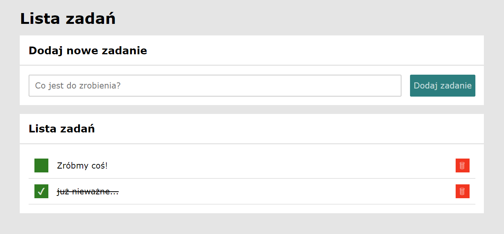

# Task List
https://yahtzee90.github.io/task_list/ 

It's a simple task list using just HTML, CSS, and JS.

You can add new tasks, mark them as done, or delete the ones you don't need. You can everything! Just remember, tasks cannot be saved, so don't refresh the page.

